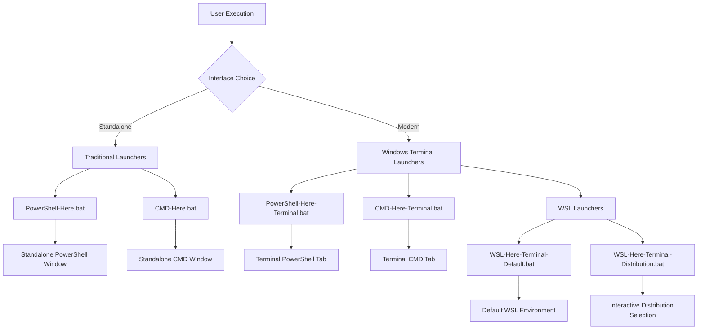
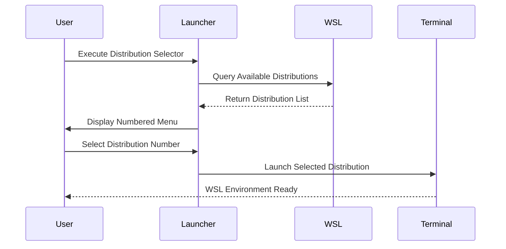

# xsukax Command Line Interface Launcher Suite

## Project Overview

The xsukax Command Line Interface Launcher Suite is a comprehensive collection of lightweight utilities designed to streamline developer workflows by providing instant access to customized command line environments. This suite consists of six optimized batch files that launch various command line interfaces with pre-configured styling, branding, and environment settings.

The launcher suite eliminates the friction of manual environment setup by automatically configuring visual themes, window titles, working directories, and shell preferences. It supports both traditional standalone command line windows and modern Windows Terminal integration, allowing developers and system administrators to choose their preferred interface while maintaining consistent branding and functionality across all environments.

**Core Components:**
- **Traditional Launchers**: PowerShell and CMD with standalone window customization
- **Windows Terminal Integration**: Modern tabbed interface support for PowerShell, CMD, and WSL
- **WSL Support**: Multiple options for Windows Subsystem for Linux integration
- **Cross-Environment Compatibility**: Seamless operation across Windows versions and configurations

## Security and Privacy Benefits

### Zero-Trust Local Execution Model
- **Complete Offline Operation**: All functionality operates entirely offline without network dependencies or external service communications
- **No Data Collection**: Zero telemetry, analytics, user tracking, or data transmission mechanisms implemented
- **Local-Only Processing**: All operations remain within the user's local environment, ensuring complete data sovereignty

### Minimal System Footprint Security
- **Non-Invasive Design**: No registry modifications, system-wide configuration changes, or permanent system alterations
- **Standard User Permissions**: Operates within standard user security context without requiring administrative privileges or elevation
- **Sandboxed Execution**: Launches command line interfaces within existing user permissions, preventing privilege escalation vectors
- **No Background Services**: Does not install services, drivers, or persistent background processes

### Transparent Security Architecture
- **Open Source Visibility**: Complete functionality contained within human-readable batch files with no obfuscated, compiled, or binary components
- **Audit-Friendly Codebase**: Simple, reviewable source code enables comprehensive security auditing and verification
- **No Hidden Dependencies**: Utilizes only standard Windows command line tools and built-in system components
- **Deterministic Behavior**: Predictable execution paths with no dynamic code generation or remote content loading

### Windows Terminal Security Integration
- **Profile-Based Security**: Leverages Windows Terminal's built-in security model and profile isolation
- **Context Preservation**: Maintains user security context across all launched environments
- **Process Isolation**: Each launched environment runs in its own isolated process space

## Features and Advantages

### Dual Interface Architecture
- **Legacy Compatibility**: Traditional standalone CMD and PowerShell launchers for maximum compatibility
- **Modern Integration**: Windows Terminal support for enhanced user experience with tabbed interfaces
- **Flexible Deployment**: Choose between standalone or Terminal-integrated workflows based on requirements

### Enhanced Developer Productivity
- **Context-Aware Launch**: Automatically configures working directory to launcher location for immediate project access
- **Persistent Sessions**: Command line interfaces remain open for continuous development workflows
- **Instant Environment Setup**: One-click access to fully configured development environments
- **Consistent Branding**: Professional "xsukax" branding across all environments for easy identification

### Cross-Platform Shell Support
- **PowerShell Integration**: Support for both legacy Windows PowerShell and modern PowerShell Core
- **Traditional CMD Support**: Full compatibility with Windows Command Prompt environments
- **WSL Multi-Distribution**: Comprehensive Windows Subsystem for Linux support with distribution selection
- **Adaptive Configuration**: Automatic detection and configuration based on available system components

### Advanced WSL Capabilities
- **Distribution Selection**: Interactive menu for choosing specific WSL distributions
- **Default Distribution Support**: Quick launch option for default WSL environment
- **Path Translation**: Automatic Windows-to-Linux path conversion for seamless cross-platform workflows
- **State Management**: Distribution status awareness (running/stopped) for informed selection

### Visual Customization and Theming
- **Professional Color Schemes**: Eye-strain reducing green-on-black themes for extended development sessions
- **Branded Window Titles**: Distinctive identification across multiple open command line sessions
- **Consistent Visual Identity**: Uniform theming across all launcher variants
- **Terminal Profile Integration**: Seamless integration with Windows Terminal's theming system

## Installation Instructions

### System Requirements
- **Operating System**: Windows 10 version 1903 or later (Windows 11 recommended)
- **User Permissions**: Standard user account with file execution privileges
- **Optional Dependencies**: 
  - Windows Terminal (recommended, available from Microsoft Store)
  - Windows Subsystem for Linux (for WSL launchers)
  - PowerShell 5.1 or later

### Installation Process

1. **Download Project Files**
   ```bash
   git clone https://github.com/xsukax/xsukax-Command-Line-Interface-Launcher-Suite.git
   cd xsukax-Command-Line-Interface-Launcher-Suite
   # or download ZIP and extract
   ```

2. **Verify File Integrity**
   Ensure all six launcher files are present:
   - `PowerShell-Here.bat` (Standalone PowerShell)
   - `CMD-Here.bat` (Standalone CMD)
   - `PowerShell-Here-Terminal.bat` (Terminal PowerShell)
   - `CMD-Here-Terminal.bat` (Terminal CMD)
   - `WSL-Here-Terminal-Default.bat` (Default WSL)
   - `WSL-Here-Terminal-Distribution.bat` (WSL Distribution Selector)

3. **Choose Installation Location**
   - **Global Installation**: `C:\Tools\xsukax-launcher\`
   - **User Profile**: `%USERPROFILE%\Tools\xsukax-launcher\`
   - **Project-Specific**: Place in individual project directories for context-aware launching

4. **Set Execution Permissions**
   ```cmd
   # Verify execution permissions (should be enabled by default)
   icacls *.bat
   ```

5. **Optional: Windows Terminal Configuration**
   For enhanced Windows Terminal integration, consider adding custom profiles:
   ```json
   {
     "name": "xsukax PowerShell",
     "commandline": "powershell.exe -NoExit -Command \"Write-Host 'xsukax PowerShell Started' -ForegroundColor Green\"",
     "startingDirectory": "%USERPROFILE%",
     "colorScheme": "Campbell"
   }
   ```

6. **Optional: Create Desktop Shortcuts**
   - Right-click desired `.bat` files
   - Select "Send to" → "Desktop (create shortcut)"
   - Customize shortcut names and icons as preferred

### Verification
Test installation by executing any launcher file. Successful installation should result in immediate command line environment launch with xsukax branding.

## Usage Guide

### Architecture Overview

The launcher suite operates on a modular architecture supporting multiple interface paradigms:



### Traditional Standalone Launchers

#### PowerShell Environment (PowerShell-Here.bat)
**Purpose**: Launches standalone PowerShell window with custom theming
**Features**:
- Black background with green foreground text
- Custom window title: "xsukax PowerShell"
- Working directory set to launcher location
- Persistent session with `-NoExit` parameter

**Usage**:
1. Navigate to desired project directory
2. Double-click `PowerShell-Here.bat`
3. PowerShell opens with full customization applied

#### CMD Environment (CMD-Here.bat)
**Purpose**: Launches standalone Command Prompt with enhanced styling
**Features**:
- Bright green text on black background (color code 0A)
- Custom window title: "xsukax CMD"
- Working directory set to launcher location
- Persistent session with `/k` parameter

**Usage**:
1. Navigate to desired project directory
2. Double-click `CMD-Here.bat`
3. CMD opens with styling and branding applied

### Windows Terminal Integration

#### Modern PowerShell Launcher (PowerShell-Here-Terminal.bat)
**Purpose**: Opens PowerShell tab in Windows Terminal with enhanced experience
**Features**:
- Integrates with Windows Terminal's PowerShell profile
- Custom tab title: "xsukax PowerShell"
- Working directory preservation
- Welcome message with green text formatting

**Usage**:
```cmd
# Direct execution
PowerShell-Here-Terminal.bat

# Or double-click from file explorer
```

#### Modern CMD Launcher (CMD-Here-Terminal.bat)
**Purpose**: Opens CMD tab in Windows Terminal with professional styling
**Features**:
- Uses Windows Terminal's Command Prompt profile
- Custom tab title: "xsukax CMD"
- Enhanced color scheme (bright green on black)
- Startup confirmation message

**Usage**:
```cmd
# Direct execution
CMD-Here-Terminal.bat

# Or double-click from file explorer
```

### WSL Integration Workflows

#### Default WSL Launcher (WSL-Here-Terminal-Default.bat)
**Purpose**: Quick access to default WSL distribution
**Features**:
- Launches default configured WSL distribution
- Automatic path translation (Windows → Linux)
- Windows Terminal integration
- Immediate environment availability


**Usage**:
1. Ensure WSL is installed with at least one distribution
2. Execute `WSL-Here-Terminal-Default.bat`
3. Default WSL environment opens in Windows Terminal

#### Interactive Distribution Selector (WSL-Here-Terminal-Distribution.bat)
**Purpose**: Choose specific WSL distribution with interactive menu
**Features**:
- Dynamic distribution detection
- User-friendly selection interface
- Distribution status display (running/stopped)
- Error handling and installation guidance



**Interactive Workflow**:
1. Execute `WSL-Here-Terminal-Distribution.bat`
2. Review displayed distribution list:
   ```
   xsukax WSL Distribution Selector
   ================================
   
   Available WSL Distributions:
   
   1. Ubuntu
   2. Debian
   3. kali-linux
   
   Distribution: 
   ```
3. Enter distribution name exactly as displayed
4. Selected environment launches in Windows Terminal

### Advanced Usage Patterns

#### Project-Specific Integration
**Workflow**: Place launchers in project root directories for context-aware development
```
ProjectRoot/
├── src/
├── docs/
├── PowerShell-Here-Terminal.bat
├── WSL-Here-Terminal-Default.bat
└── README.md
```

**Benefits**:
- Immediate access to project directory
- Consistent development environment setup
- Version control integration (add to .gitignore if desired)

#### Multi-Environment Development
**Scenario**: Working across Windows and Linux environments simultaneously
1. Launch `PowerShell-Here-Terminal.bat` for Windows development tasks
2. Launch `WSL-Here-Terminal-Default.bat` for Linux-specific development
3. Use Windows Terminal's tab management for seamless switching

#### System Administration Workflows
**Use Case**: Server management and system administration
1. Place launchers in administrative directories
2. Use elevated permissions when necessary
3. Leverage consistent branding for session identification

### Troubleshooting and Optimization

#### Common Issues and Solutions

**Windows Terminal Not Found**:
- Install Windows Terminal from Microsoft Store
- Verify `wt.exe` is in system PATH
- Use standalone launchers as fallback

**WSL Distribution Not Detected**:
- Verify WSL installation: `wsl --status`
- List available distributions: `wsl --list --verbose`
- Install distributions via Microsoft Store or `wsl --install`

**Permission Errors**:
- Ensure script execution permissions are enabled
- Run from elevated command prompt if necessary
- Check antivirus software for script blocking

#### Performance Optimization
- Place frequently used launchers on desktop or in PATH
- Use keyboard shortcuts for rapid access
- Configure Windows Terminal startup settings for optimal performance

## Licensing Information

This project is licensed under the **GNU General Public License v3.0** (GPL-3.0), ensuring that this software remains free and open source while protecting both users and contributors.

### Comprehensive License Overview

**Core Philosophy**: The GPL-3.0 license embodies the principles of software freedom, ensuring that users have the fundamental rights to use, study, modify, and distribute the software while preventing proprietary restrictions that could limit these freedoms.

### License Compliance and Community Standards

This project embraces the collaborative spirit of open source development while ensuring license compliance through:

**Transparent Development Process**:
- All development occurs in public repositories with full history
- Code review processes ensure quality and license compliance
- Community feedback and contributions are welcomed and encouraged

**Educational and Documentation Resources**:
- Comprehensive documentation supports proper usage and modification
- Examples and tutorials demonstrate compliance best practices
- Community forums provide guidance on license interpretation

**Enforcement and Community Relations**:
- Good faith compliance efforts are recognized and supported
- Community-driven resolution of compliance questions
- Commitment to educating users about rights and responsibilities

### Additional Resources

For complete license terms and legal details, please reference:
- **Full GPL-3.0 Text**: [GNU General Public License v3.0](https://www.gnu.org/licenses/gpl-3.0.en.html)
- **FSF License Commentary**: [Free Software Foundation GPL Guide](https://www.gnu.org/licenses/gpl-howto.en.html)
- **SPDX License Identifier**: `GPL-3.0-or-later`
