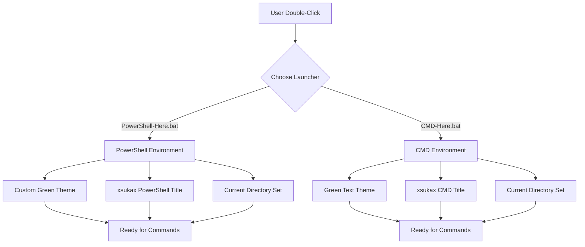
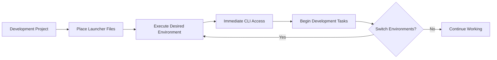

# xsukax Command Line Interface Launcher (CMD Here - PoweShell Here)

## Project Overview

The xsukax Command Line Interface Launcher is a lightweight, efficient utility designed to provide developers and system administrators with quick access to customized PowerShell and CMD environments. This application consists of two optimized batch files that launch command line interfaces with pre-configured styling and branding, streamlining the development workflow and enhancing the user experience.

The launcher eliminates the need for manual environment setup by automatically configuring visual themes, window titles, and working directories, allowing users to focus immediately on their tasks rather than spending time on interface customization.

## Security and Privacy Benefits

### Local Execution Model
- **No Network Dependencies**: All operations are performed locally without requiring internet connectivity or external service communications
- **No Data Transmission**: Zero telemetry, analytics, or user data collection mechanisms are implemented
- **Offline Operation**: Complete functionality available without network access, ensuring data remains within your local environment

### Minimal System Footprint
- **No Registry Modifications**: The application does not modify Windows registry entries or system-wide configurations
- **No Administrative Privileges Required**: Operates within standard user permissions, reducing security risk exposure
- **Sandboxed Execution**: Launches command line interfaces within the user's current security context without privilege escalation

### Transparent Source Code
- **Open Source Visibility**: All functionality is contained within readable batch files with no obfuscated or compiled components
- **Audit-Friendly**: Simple codebase allows for easy security review and verification of operations
- **No Hidden Processes**: Launches standard Windows command line tools without additional background services

## Features and Advantages

### Customized Visual Environment
- **Branded Interface**: Distinctive "xsukax" branding applied to window titles for easy identification
- **Enhanced Readability**: Green-on-black color scheme for PowerShell and CMD reduces eye strain during extended use
- **Professional Appearance**: Consistent theming across both PowerShell and CMD environments

### Developer Productivity
- **Context-Aware Launch**: Automatically sets working directory to the launcher's location
- **Persistent Sessions**: Command line interfaces remain open for continuous use (`-NoExit` for PowerShell, `/k` for CMD)
- **Quick Access**: Double-click execution provides immediate access to configured environments

### Cross-Environment Support
- **Dual Interface Options**: Supports both modern PowerShell and traditional CMD workflows
- **Windows Compatibility**: Designed for optimal performance across Windows operating systems
- **Lightweight Design**: Minimal resource consumption with instant startup times

## Usage Guide

### Basic Operation

The application provides two distinct launch methods for different command line environments:

### PowerShell Environment Launch

1. **Execute PowerShell-Here.bat**
   - Double-click the file or run from command line
   - Launches PowerShell with enhanced configuration

2. **Environment Features**
   - Window title: "xsukax PowerShell"
   - Color scheme: Green text on black background
   - Working directory: Set to launcher file location
   - Session persistence: Remains open until manually closed

### CMD Environment Launch

1. **Execute CMD-Here.bat**
   - Double-click the file or run from command line
   - Launches CMD with custom styling

2. **Environment Features**
   - Window title: "xsukax CMD"
   - Color scheme: Bright green text on black background (color code 0A)
   - Working directory: Set to launcher file location
   - Session persistence: Remains open until manually closed

### Workflow Integration

### Common Use Cases

- **Project Development**: Place launchers in project root for quick access to project-specific command line environments
- **System Administration**: Utilize from administrative directories for server management tasks
- **Script Development**: Launch configured environments for testing and debugging batch files and PowerShell scripts
- **Educational Purposes**: Provide students with consistent, branded command line environments for learning

## Licensing Information

This project is licensed under the **GNU General Public License v3.0** (GPL-3.0).

### License Summary

The GPL-3.0 license ensures that this software remains free and open source while protecting both users and contributors:

**Key Permissions:**
- **Commercial Use**: Free to use for commercial purposes
- **Modification**: Full right to modify and customize the source code
- **Distribution**: Permission to distribute original or modified versions
- **Patent Use**: Express grant of patent rights from contributors

**Key Requirements:**
- **Source Disclosure**: Modified versions must include source code
- **License Preservation**: GPL-3.0 license must be included with distributions
- **State Changes**: Modifications must be clearly documented

**Key Limitations:**
- **No Warranty**: Software provided without warranty or liability
- **No Trademark Rights**: License does not grant trademark permissions

### For Users
You are free to use, modify, and distribute this software for any purpose, including commercial use, provided you comply with the license terms by preserving copyright notices and making source code available when distributing modified versions.

### For Contributors
By contributing to this project, you agree that your contributions will be licensed under the same GPL-3.0 terms, ensuring the project remains free and open source for all users.

For the complete license text, please refer to the [GNU General Public License v3.0](https://www.gnu.org/licenses/gpl-3.0.en.html) official documentation.
